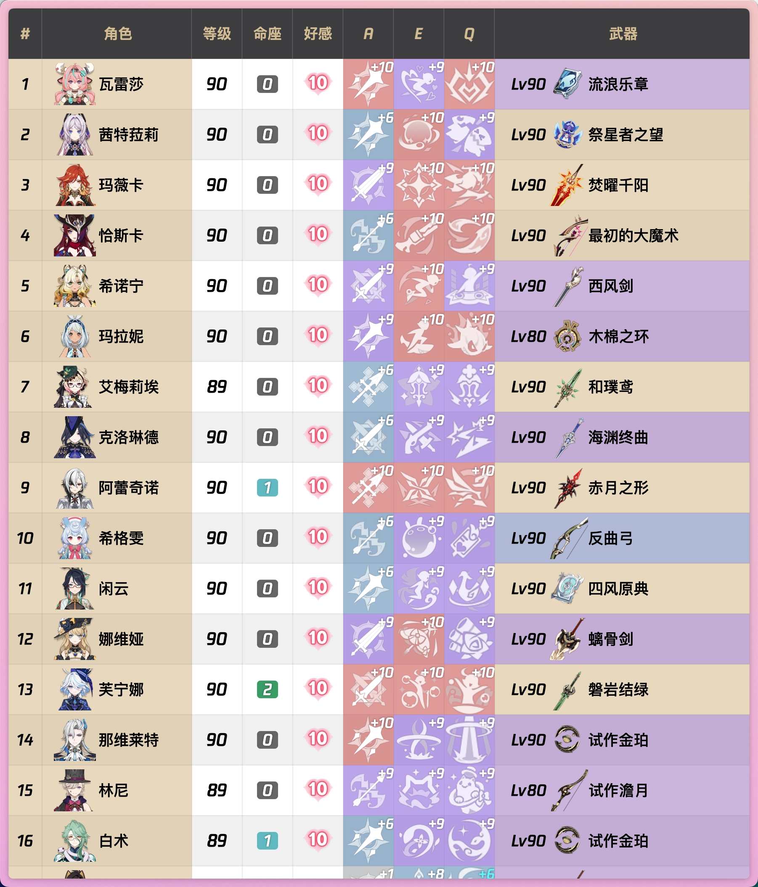
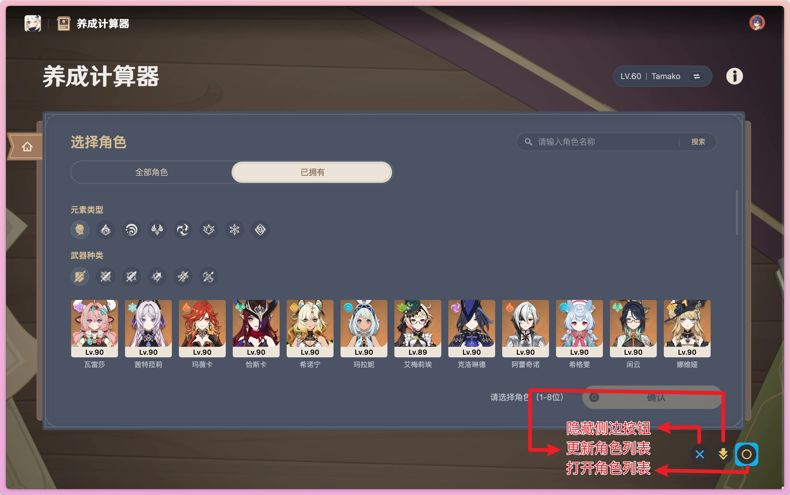

# Better Miyoushe

> readme version: 2025.5.23

Make Miyoushe Great Again

让米游社再次伟大！！！

美化米游社页面，移除页面冗余内容。

---

美化后首页显示效果，以及右下角侧边按钮


角色列表界面（样式参考 yunzai-bot）



---

侧边按钮指南



TODO

- [x] 角色列表
- [x] 调整按钮逻辑，增加刷新按钮，分离移动和点击事件

---

脚本使用

1. 下载 chrome/chromium 浏览器的 tempermonkey 插件
2. 安装脚本[脚本地址](https://greasyfork.org/zh-CN/scripts/530831-better-miyoushe)

源码使用

```shell
pnpm install

pnpm dev
```

构建项目

```shell
pnpm build
```

blob-html 需要单独构建使用

本项目仅供学习参考使用，最终解释权归米哈游所有
